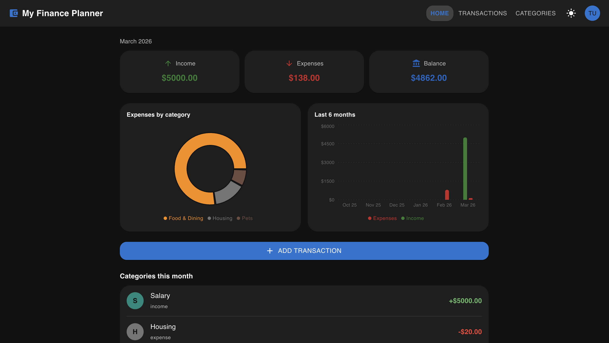
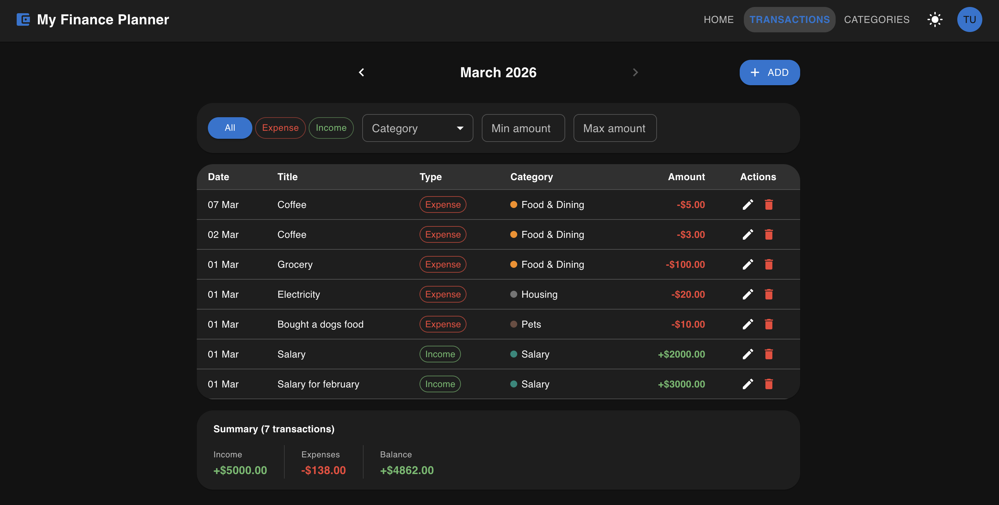

# Finance Planner

A fullstack personal finance tracking application. Track income and expenses by category, visualise spending trends and manage your budget month by month.





## Live demo

🔗 [https://my-finance-planner.onrender.com/](https://my-finance-planner.onrender.com/)

**Test account**
```bash
Login: testuser
Password: testpass123
```
---
## Tech stack

| Layer | Technology |
|---|---|
| Frontend | React 19, Vite 7 |
| UI library | MUI v7 (Material UI) |
| Data fetching | TanStack React Query v5 |
| Routing | React Router v7 |
| Charts | Recharts |
| HTTP client | Axios |
| Dates | Day.js |
| Backend | Node.js, Express 5 |
| Database | MongoDB, Mongoose |
| Auth | JWT (Bearer token) |

---

## Features

- **Authentication** — register / login with JWT; token persists in `localStorage`
- **Dashboard** — monthly summary cards (Income, Expenses, Balance), expense breakdown pie chart, 6-month income vs expenses bar chart, category totals list
- **Transactions** — table view with month navigation, filter by type / category / amount range, inline edit and delete
- **Categories** — create, edit (name + colour) and delete custom categories; default system categories are read-only
- **Voice input** — dictate a transaction in plain English; the browser's Web Speech API captures speech and Gemini AI extracts the title, amount, type, and date automatically
- **Dark / Light mode** — toggle in the nav bar, preference saved to `localStorage`
- **Responsive** — desktop nav bar with inline links; mobile hamburger drawer

---

## About this project

Built as a self-directed personal project to practice full-stack development end-to-end — from database schema design to deployed UI. The goal was to go beyond tutorial scope: real auth, real test coverage, and a feature (voice input) that required integrating an external AI API.

---

## Architecture decisions

**MongoDB over PostgreSQL** — the data model for this app is document-oriented by nature: each transaction and category belongs to a single user and is rarely queried relationally across users. MongoDB fit naturally without requiring joins, and Mongoose kept the schema validation straightforward. For a future version with complex reporting or multi-user analytics, a relational DB would be worth reconsidering.

**JWT in localStorage over httpOnly cookies** — a deliberate tradeoff. LocalStorage is vulnerable to XSS attacks, while httpOnly cookies protect against that but introduce CSRF complexity. For this project scope (no sensitive financial data, single-user auth), the simpler approach was chosen consciously. In a production app handling real user finances, httpOnly cookies with CSRF tokens would be the right call.

---

## Project structure

```
finance-planner/
├── backend/
│   ├── controllers/
│   │   ├── categories.js
│   │   ├── expenses.js
│   │   ├── incomes.js
│   │   ├── login.js
│   │   └── users.js
│   ├── models/
│   │   ├── category.js
│   │   ├── expense.js
│   │   ├── income.js
│   │   └── user.js
│   ├── utils/
│   │   ├── config.js
│   │   ├── logger.js
│   │   └── middleware.js
│   ├── app.js
│   ├── index.js
│   └── .env
│
└── frontend/
    └── src/
        ├── components/
        │   ├── charts/
        │   │   ├── ExpensePieChart.jsx
        │   │   └── MonthlyBarChart.jsx
        │   ├── AddCategoryDialog.jsx
        │   ├── AddTransactionDialog.jsx
        │   ├── CategoryRow.jsx
        │   ├── EditCategoryDialog.jsx
        │   ├── EditTransactionDialog.jsx
        │   ├── NavBar.jsx
        │   ├── ProtectedRoute.jsx
        │   └── SummaryCard.jsx
        ├── context/
        │   ├── AuthContext.jsx
        │   └── ThemeContext.jsx
        ├── hooks/
        │   └── useAuth.js
        ├── pages/
        │   ├── CategoriesPage.jsx
        │   ├── DashboardPage.jsx
        │   ├── LoginPage.jsx
        │   └── TransactionsPage.jsx
        ├── services/
        │   ├── api.js
        │   ├── authService.js
        │   ├── categoriesService.js
        │   ├── expensesService.js
        │   └── incomesService.js
        ├── App.jsx
        ├── main.jsx
        └── router.jsx
```

---

## Getting started

### Prerequisites

- Node.js 18+
- MongoDB instance (local or Atlas)

### 1. Clone the repo

```bash
git clone <repo-url>
cd finance-planner
```

### 2. Backend setup

```bash
cd backend
npm install
```

Create a `.env` file in `backend/`:

```env
MONGODB_URI=mongodb://localhost:27017/finance-planner
TEST_MONGODB_URI=mongodb://localhost:27017/finance-planner-test
PORT=3003
SECRET=your_jwt_secret_here
GEMINI_API_KEY=your_gemini_api_key_here
```

Start the backend:

```bash
npm run dev      # development (watch mode)
npm start        # production
```

The API will be available at `http://localhost:3003`.

### 3. Frontend setup

```bash
cd frontend
npm install
npm run dev
```

The app will be available at `http://localhost:5173`. The Vite dev server proxies all `/api` requests to `http://localhost:3003` automatically.

---

## API reference

All endpoints (except `/api/login` and `/api/users`) require:
```
Authorization: Bearer <token>
```

### Auth

| Method | Endpoint | Description |
|---|---|---|
| `POST` | `/api/login` | Login — returns `{ token, username, name }` |
| `POST` | `/api/users` | Register a new user |

### Categories

| Method | Endpoint | Description |
|---|---|---|
| `GET` | `/api/categories` | Get all categories (default + user's own) |
| `POST` | `/api/categories` | Create a category `{ name, type, color }` |
| `PUT` | `/api/categories/:id` | Update name and color (not type) |
| `DELETE` | `/api/categories/:id` | Delete (own categories only) |

Category `type` must be `"income"` or `"expense"`.

### Expenses

| Method | Endpoint | Description |
|---|---|---|
| `GET` | `/api/expenses` | Get all expenses for the logged-in user |
| `POST` | `/api/expenses` | Create `{ title, amount, date, category }` |
| `PUT` | `/api/expenses/:id` | Update expense |
| `DELETE` | `/api/expenses/:id` | Delete expense |

### Incomes

| Method | Endpoint | Description |
|---|---|---|
| `GET` | `/api/incomes` | Get all incomes for the logged-in user |
| `POST` | `/api/incomes` | Create `{ title, amount, date, category }` |
| `PUT` | `/api/incomes/:id` | Update income |
| `DELETE` | `/api/incomes/:id` | Delete income |

> `title` — required, min 2 chars, letters / numbers / spaces / underscores only
> `amount` — required, number ≥ 0
> `category` — optional, must be a valid category ID accessible to the user

---

## Testing

The backend uses Node.js's built-in test runner (`node:test`) with [Supertest](https://github.com/ladjs/supertest) for HTTP assertions. Tests run against a separate test database defined by `TEST_MONGODB_URI` in `backend/.env`.

### Run all tests

```bash
cd backend
npm test
```

### Run a single test file

```bash
cd backend
NODE_ENV=test node --test tests/expenses_api.test.js
```

### Test files

| File | What it covers |
|---|---|
| `tests/users_api.test.js` | User registration, duplicate username |
| `tests/expenses_api.test.js` | Full CRUD for expenses, auth, validation |
| `tests/incomes_api.test.js` | Full CRUD for incomes, auth, validation |
| `tests/categories_api.test.js` | Full CRUD for categories, default category protection |

### What is tested

Each API test file covers:
- Successful CRUD operations
- Auth enforcement — `401` when no token is provided
- User isolation — users can only access their own data
- Validation — `400` for missing required fields, short titles, invalid types/colors
- Ownership checks — `401` when operating on another user's resource
- Default category protection — default categories cannot be edited or deleted
- `404` for non-existing IDs, `400` for malformed IDs

> Tests run sequentially (`--test-concurrency=1`) to avoid race conditions on the shared test database.

---

## Frontend routes

| Path | Page | Access |
|---|---|---|
| `/login` | Login | Public |
| `/` | Dashboard | Protected |
| `/transactions` | Transactions | Protected |
| `/categories` | Categories | Protected |

---

## Environment variables

### Backend (`backend/.env`)

| Variable | Description |
|---|---|
| `MONGODB_URI` | MongoDB connection string |
| `TEST_MONGODB_URI` | MongoDB connection string for tests |
| `PORT` | Port the Express server listens on (default `3003`) |
| `SECRET` | Secret key used to sign JWT tokens |
| `GEMINI_API_KEY` | Google Gemini API key for voice transaction parsing |

---

## Voice input

The voice input feature lets users add a transaction by speaking instead of typing.

**How it works:**

1. The user clicks the microphone button on the Add Transaction page.
2. The browser's built-in **Web Speech API** (`SpeechRecognition`) transcribes the speech to text.
3. The transcript is sent to `POST /api/voice/parse` on the backend.
4. The backend calls **Google Gemini 2.5 Flash** with a structured prompt, which extracts `title`, `amount`, `type` (`income` / `expense`), and `date` from the natural-language sentence.
5. The parsed fields are returned as JSON and pre-fill the transaction form, ready for review and submission.

**Example phrases:**
- *"Spent 45 euros on groceries yesterday"*
- *"Got paid 2000 for freelance work on March 1st"*
- *"Coffee 3.50 this morning"*

**Browser support:** requires a browser that supports the Web Speech API (Chrome / Edge recommended). The microphone button is hidden automatically when the API is unavailable.

**Setup:** add `GEMINI_API_KEY` to `backend/.env` (get a free key at [Google AI Studio](https://aistudio.google.com/)).
